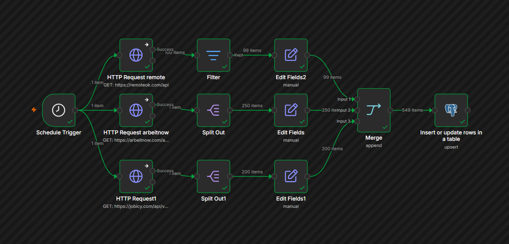
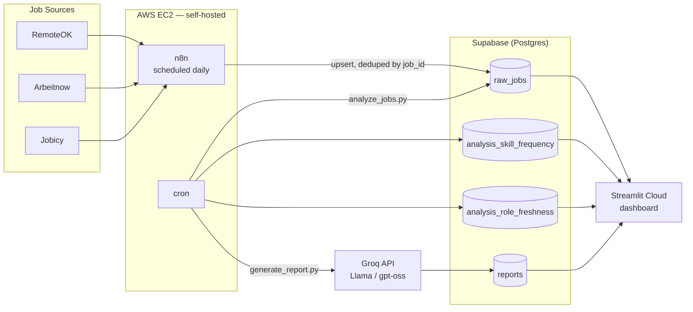

<div align="center">

# 🧭 Remote Job Market Pipeline

**An end-to-end data pipeline that scrapes, stores, analyzes, and reports on the remote job market — fully automated, running unattended, 24/7.**

[](https://job-market-pipeliine.streamlit.app/)


**[→ Open the live dashboard](https://job-market-pipeliine.streamlit.app/)**

</div>

---

## What this is

Every day, without anyone touching it, this project runs through five stages:

1. 🔎 **Scrapes** — three remote-job platforms are queried in parallel for their current listings
2. 🧹 **Deduplicates** — each posting is matched against everything seen before by a unique `job_id`; new postings are inserted, existing ones are updated rather than duplicated, and a "still live as of" timestamp is refreshed
3. 📊 **Analyzes** — skill/tag frequency is recomputed across the whole live dataset, and every posting is classified as *active*, *cooling*, or *stale* based on how recently it last reappeared in a scrape
4. ✍️ **Reports** — the day's numbers are handed to an LLM, which writes a short, plain-English summary of what's actually happening in the market
5. 📈 **Displays** — a public dashboard reads all of the above and renders it as filterable charts and a browsable table

No manual steps, no scheduled reminders to run something by hand — the whole thing runs on its own, every 24 hours, on a $0/month stack (aside from a small EC2 instance).



---

## Architecture



### Walking through it, stage by stage

**① The three sources run in parallel, not in sequence.**
n8n's Schedule Trigger fans out to three independent `HTTP Request` branches — one per platform — rather than calling them one after another. This matters for two reasons: it's faster, and each branch fails independently, so if one API is temporarily down (this happened — see [Problems hit and fixed](#-problems-hit-and-fixed)), the other two still complete and save their data.

**② Each branch is normalized into a common shape before merging.**
RemoteOK, Arbeitnow, and Jobicy each return wildly different JSON structures — different field names, different nesting, different date formats (RemoteOK gives an ISO date, Arbeitnow gives a Unix timestamp, Jobicy gives none at all). Each branch has its own `Split Out` (to break a nested array into individual items) and `Edit Fields` node (to rename/reshape fields into one shared schema: `job_id`, `title`, `company`, `location`, `remote`, `tags`, `url`, `posted_date`, `source`) before a `Merge` node combines all three into a single stream.

**③ Writing to Postgres is an upsert, not an insert.**
The Postgres node is set to "Insert or update rows," matching on `job_id`. On a brand-new job, it inserts a row and sets `scraped_at`/`last_seen_at` to now. On a job it's seen before, it updates `last_seen_at` to now but leaves `scraped_at` untouched — so the database always knows both *when a posting first appeared* and *whether it's still around*, without ever creating a duplicate row for the same job.

**④ Analysis runs separately from scraping, on a delay.**
A cron job on the same EC2 instance runs `analyze_jobs.py` a few minutes after n8n's daily scrape is expected to finish. It pulls the entire `raw_jobs` table, explodes the `tags` array to count skill frequency, and computes each posting's `days_since_last_seen` to classify it as active (seen in the last day), cooling (within a week), or stale (longer). Both results are written to their own analysis tables, timestamped, so the dashboard can always ask for "the latest snapshot."

**⑤ The report is generated from real numbers, not free-form.**
`generate_report.py` runs right after the analysis job. It builds a prompt that includes the actual computed totals, skill counts, and freshness breakdown, and explicitly instructs the model not to invent numbers outside what's given — the LLM's job is to narrate the data, not generate it. The result replaces the previous report in Supabase (only the single most recent one is kept).

**⑥ The dashboard is a thin, read-only layer on top.**
Streamlit's `app.py` and `pages/1_Report.py` never write anything back — they just query the four Supabase tables, cache the results for 10 minutes, and render them as metrics, charts, and a filterable table. All the actual work happens upstream; the dashboard's only job is to make it visible.

---

## Tech stack — what, and why

| Layer | Tool | Why this, specifically |
|---|---|---|
| 🧩 **Orchestration** | [n8n](https://n8n.io) (self-hosted, Docker) | Visual workflow editor makes 3 parallel API calls + field mapping easy to build and debug; free to self-host |
| ☁️ **Hosting** | AWS EC2 (t2/t3.micro) | Free-tier eligible; chosen over Oracle Cloud after Oracle's card-verification and regional capacity issues made it impractical |
| 🗄️ **Database** | [Supabase](https://supabase.com) (Postgres) | Free tier, real SQL, and a connection pooler built for exactly this access pattern — short, scheduled connections rather than one long-lived one |
| ⏱️ **Scheduling (analysis)** | `cron` | Runs the Python analysis and reporting scripts daily on the same EC2 instance, a few minutes after n8n's scrape completes |
| 🐍 **Analysis** | Python — `pandas`, `SQLAlchemy` | Skill/tag frequency counting and role-freshness classification (active / cooling / stale) |
| 🤖 **AI reporting** | [Groq API](https://groq.com) (Llama / gpt-oss) | Free, fast, hosted — deliberately *not* a local LLM, since the 1GB-RAM EC2 instance couldn't run one without crashing (see below) |
| 📊 **Dashboard** | [Streamlit](https://streamlit.io) + Plotly | Free hosting on Community Cloud, native Python, click-to-filter charts without needing a separate frontend framework |
| 🔧 **Version control** | Git + GitHub | This repo |

<details>
<summary><b>Why not Power BI / a local LLM / Oracle Cloud? (click to expand)</b></summary>

- **Power BI over Streamlit** — not used. Streamlit keeps everything in Python (same language as the analysis layer), deploys free, and demonstrates full-stack build ability rather than BI-tool configuration.
- **Local Ollama over Groq** — evaluated and rejected. The EC2 instance has ~1GB RAM, barely enough for n8n alone. A local LLM on top of that caused repeated out-of-memory crashes (see [Problems hit and fixed](#-problems-hit-and-fixed)).
- **Oracle Cloud over AWS** — evaluated and rejected. Oracle's Always Free tier requires card verification with strict card-type rules and has known regional capacity issues. AWS, already available, proved more reliable in practice.
- **Google Sheets export** — planned, then deliberately cut. Postgres already serves as the single source of truth; a parallel Sheets export would add OAuth setup and another failure point for no real analytical benefit.

</details>

---

## Live dashboard

**[job-market-pipeliine.streamlit.app](https://job-market-pipeliine.streamlit.app/)**

- **Overview page** — total jobs, active/stale breakdown, a date-range explorer, top skills, and click-to-filter charts (click a bar, the job table below filters to match)
- **Report page** — the current AI-generated market summary, regenerated daily

---

## 🛠️ Setup

<details>
<summary><b>1. Database</b></summary>

Run <code>sql/schema.sql</code> in your Supabase project's SQL Editor. This creates four tables:

- <code>raw_jobs</code> — every deduplicated posting, with <code>scraped_at</code> (first seen) and <code>last_seen_at</code> (most recently confirmed live)
- <code>analysis_skill_frequency</code> — timestamped skill-count snapshots
- <code>analysis_role_freshness</code> — timestamped active/cooling/stale classifications, one row per job per snapshot
- <code>reports</code> — the single current AI-generated summary

</details>

<details>
<summary><b>2. n8n</b></summary>

Import <code>n8n/job-scraper-pipeline.json</code>. You'll need to:
1. Add a Postgres credential using Supabase's <b>Transaction Pooler</b> connection details, not the direct connection — the direct connection defaults to IPv6, which most small VPS instances can't reach (see the troubleshooting notes below for the exact symptom this causes)
2. Set the Schedule Trigger to your preferred interval (daily, at a fixed hour, is what's used here)
3. Enable "Continue On Fail" on each of the three <code>HTTP Request</code> nodes, so one source being down doesn't block the other two
4. <b>Publish</b> the workflow — and if you ever edit it afterward, unpublish and republish again, since edits to a published workflow don't always re-register cleanly

</details>

<details>
<summary><b>3. Python scripts (analysis + reporting)</b></summary>

```bash
pip install -r python/requirements.txt
```

Set these as environment variables — declared directly in the crontab itself (with a leading <code>SHELL=/bin/bash</code> line), not sourced from <code>.bashrc</code>, since cron's non-interactive shells exit <code>.bashrc</code> before reaching any <code>export</code> lines:

```
SUPABASE_DB_HOST
SUPABASE_DB_USER
SUPABASE_DB_PASSWORD
GROQ_API_KEY
```

Schedule <code>analyze_jobs.py</code> and <code>generate_report.py</code> via cron, a few minutes apart — the report generator reads the analysis script's output, so it needs to run second.

</details>

<details>
<summary><b>4. Dashboard</b></summary>

```bash
pip install -r streamlit_app/requirements.txt
streamlit run streamlit_app/app.py
```

Set the same four Supabase variables as Streamlit secrets when deploying to Community Cloud (<code>shared.py</code> checks <code>st.secrets</code> first, falling back to environment variables for local runs — same code works in both places).

</details>

---

## 🐛 Problems hit and fixed

Building this surfaced real operational failures, not just "happy path" development — documented here because diagnosing and fixing them was most of the actual work.

<details>
<summary><b>Out-of-memory crash loops</b></summary>

n8n's Node process was silently killed by the Linux OOM killer on the 1GB-RAM instance — it would start, run briefly, then get terminated with no error in n8n's own logs, because the kernel kills the process from outside rather than letting it fail gracefully. Diagnosed via <code>dmesg | grep -i "killed process"</code>, which showed the process's memory footprint at the moment of the kill (over 500MB — more than half the instance's total RAM). Fixed with a swap file, sized carefully to add memory headroom without eating too much of the already-tight disk space.
</details>

<details>
<summary><b>Disk exhaustion, repeatedly</b></summary>

An 8GB root volume filled up multiple times — from Docker's image layers, n8n's own execution history (which by default keeps every run's full input/output data), and accumulated package caches from routine <code>apt</code> operations. Fixed short-term via <code>apt clean</code>, <code>docker system prune</code>, and periodic <code>VACUUM</code> on n8n's SQLite database (deleting old rows doesn't shrink a SQLite file on its own — <code>VACUUM</code> is required to actually reclaim that space on disk). Fixed structurally by enabling <code>EXECUTIONS_DATA_PRUNE</code> to auto-limit history retention, and by reducing the scrape schedule from every 6 hours to daily to cut the growth rate.
</details>

<details>
<summary><b>Cron silently failing due to environment variables</b></summary>

Cron jobs calling <code>source ~/.bashrc</code> to load database credentials failed with "missing environment variable" errors — but only when run by cron, never when the same command was run manually in an interactive terminal. The cause: most <code>.bashrc</code> files have a guard clause near the top that exits immediately for non-interactive shells, which is exactly what cron uses. The <code>export</code> lines further down the file were never being reached. Fixed by declaring the environment variables directly at the top of the crontab file instead, where cron reads them natively.
</details>

<details>
<summary><b>n8n's schedule not firing despite being "Published"</b></summary>

A newer n8n version replaced the classic Active/Inactive toggle with a Publish/Unpublish model. The workflow showed as "Published" with a healthy green status, manual executions worked fine, but the Schedule Trigger simply never fired on its own — confirmed by checking the Executions tab, where every entry had the "manual run" icon and none had the "automatic" one. n8n's own documentation notes that edits made *after* publishing (which this workflow had — "Continue On Fail" was added post-publish) don't always cause the schedule to re-register. Fixed by explicitly unpublishing and republishing after any settings change, which forces a clean re-read of the trigger configuration.
</details>

<details>
<summary><b>Deprecated LLM model</b></summary>

The originally chosen Groq model (<code>llama-3.1-8b-instant</code>) started returning a plain HTTP 404 on every request, with no other error detail. Groq had deprecated the model shortly after this project started using it. Swapped to Groq's currently-recommended general-purpose model with a one-line change and no other code changes needed — a reminder that hardcoding a specific model name is a real maintenance liability, not just a config detail.
</details>

<details>
<summary><b>Stale freshness tracking</b></summary>

The whole point of <code>last_seen_at</code> is to answer "is this job still live?" — but it was frozen at the same value as <code>scraped_at</code> for every single row, no matter how many times the pipeline had run since. The cause: the Postgres upsert node's column list only included <code>scraped_at</code> and <code>last_seen_at</code> implicitly, via each column's database-level <code>DEFAULT now()</code> — which only fires on a brand-new <code>INSERT</code>. On every later run, when the same <code>job_id</code> already existed, the node performed an <code>UPDATE</code> instead, and columns not explicitly listed in "Values to Send" are simply left untouched by an update. Fixed by explicitly adding <code>last_seen_at</code> to the upsert's column list with the expression <code>{{ $now }}</code>, so it's actively refreshed on every matching row, every run.
</details>

<details>
<summary><b>A single source outage broke the entire run</b></summary>

Arbeitnow returned an HTTP 521 (Cloudflare's "origin server is down" error) on one occasion — not a problem with this pipeline, just their API being temporarily unreachable. But because n8n's default behavior is to halt the entire execution on any single node's failure, RemoteOK and Jobicy's perfectly good, successfully-fetched data never got saved either — one dead API took the whole day's scrape down with it. Fixed by enabling "Continue On Fail" on each source's <code>HTTP Request</code> node individually, so a failure in one branch no longer prevents the other two from completing and writing their data.
</details>

---

## 📁 Repo structure

```
├── n8n/                    exported workflow + screenshot
├── python/                 analysis + LLM report generation, run via cron
├── sql/                    database schema
└── streamlit_app/          dashboard (deploy this folder's app.py to Streamlit Cloud)
```

---

<div align="center">

Built by [Ravi Dhiman](https://github.com/raviidhiman)

</div>